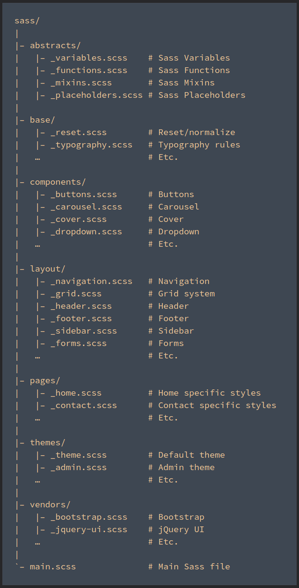

## App name
Basic SCSS Architecture you can follow in your project. It is preferable to Follow SCSS pattern which make development agile. 
To create this structure  add styles folder and change in angular.json file.

[](https://github.com/angulardevelopment/) [](https://github.com/angulardevelopment/) [](https://github.com/angulardevelopment/scss-structure/stargazers) [](https://github.com/angulardevelopment/scss-structure/network)

<p align="center">
<a href="#">

</a>
</p>


<p align="center">

</p>

#### Link for [demo](#) 
[](#)

## Useful Links

- [api](#)
- [server](#)


## Requirements

[](https://github.com/angulardevelopment/)

The source code of this project is written in **`JavaScript`, and used `multiple packages`**. 

## Instructions

[](#)

Open the project and run `ng s` 

## Pre-requisites
npm, nodejs
## Objective of the project.
upload build
## Tech stacks 
nodejs
## How to build the application.
create multiple JS files
## How to test the application.
test
## Software tools used.
vscode
## Tangible results.
build deploy
## GIFs showing user flows (if customer-facing)
Templates/screenshots of all the project pages

## Links to web pages
blog link
## Links to code/GitHub repository link
https://github.com/angulardevelopment/scss-structure
## Duration
1 month
## build creation and deployment
[command](#)
## Features
Responsive site
css flex usage
basic features of SCSS

## Support
Don't Forget to bookmark/star this repo.

## buy me a coffee /Sponsor this project

[ko-fi](https://ko-fi.com/softwaredev)

## Need help?
Feel free to contact me on this [link](https://bio.link/angulardev) 

[](https://www.facebook.com/learnangular2plus/) [](https://www.instagram.com/angular_development/) [](https://eraoftech.medium.com/ )


```bash


 _____ _                 _     __   __            
|_   _| |               | |    \ \ / /            
  | | | |__   __ _ _ __ | | __  \ V /___  _   _   
  | | | '_ \ / _` | '_ \| |/ /   \ // _ \| | | |  
  | | | | | | (_| | | | |   <    | | (_) | |_| |  
  \_/ |_| |_|\__,_|_| |_|_|\_\   \_/\___/ \__,_|  
                                                  
                                                  
______                                            
|  ___|                                           
| |_ ___  _ __                                    
|  _/ _ \| '__|                                   
| || (_) | |                                      
\_| \___/|_|                                      
                                                  
                                                  
______      _               _   _               _ 
| ___ \    (_)             | | | |             | |
| |_/ / ___ _ _ __   __ _  | |_| | ___ _ __ ___| |
| ___ \/ _ \ | '_ \ / _` | |  _  |/ _ \ '__/ _ \ |
| |_/ /  __/ | | | | (_| | | | | |  __/ | |  __/_|
\____/ \___|_|_| |_|\__, | \_| |_/\___|_|  \___(_)
                     __/ |                        
                    |___/                         

 


```

## License

**MIT &copy; [Sunny](https://github.com/angulardevelopment/scss-structure/blob/master/LICENSE)**

[](https://github.com/angulardevelopment/scss-structure/blob/master/LICENSE) 

---------

```javascript

if (youEnjoyed) {
    starThisRepository();
}

```

-----------


 
